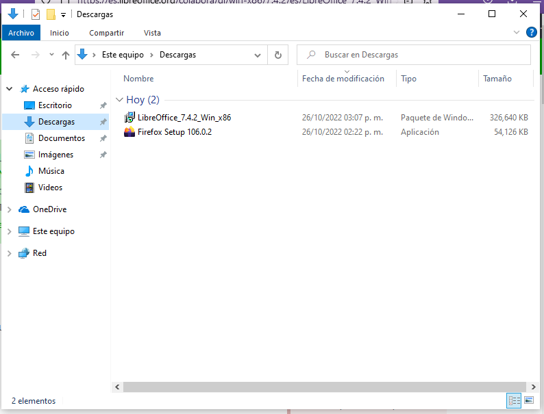
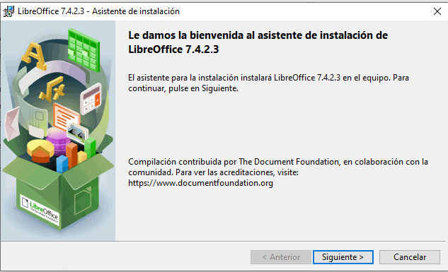
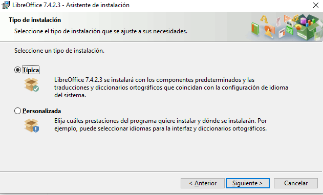
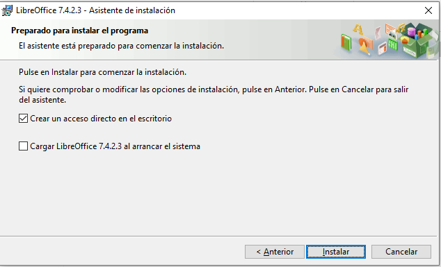
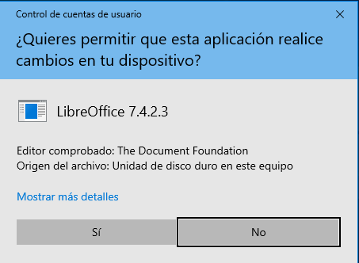
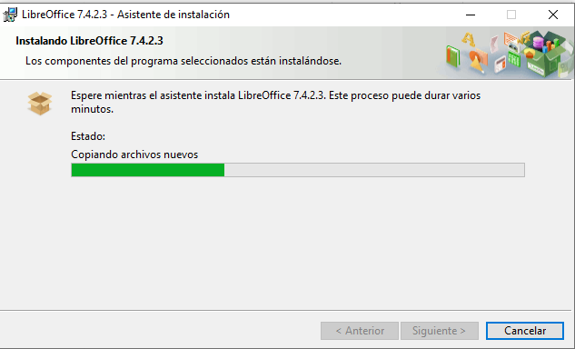
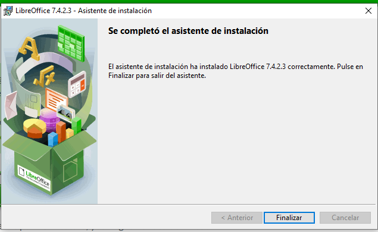
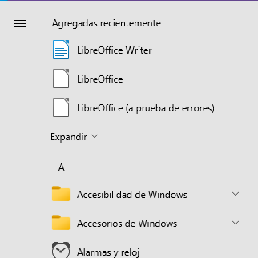
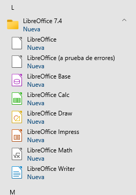

# Instala LibreOffice

## Descarga de LibreOffice

En esta práctica instalará la ofimática en su computadora, para esto abra su navegador de internet de su preferencia, no importa si es Firefox, Chrome, Safari, etc.
Diríjase a https://es.libreoffice.org/ 
 

De un click en el recuadro verde de descargar ahora. 

## Selección del sistema operativo

Normalmente, la página nos muestra el archivo de instalación que corresponde a nuestro sistema operativo, solo demos click en el recuadro amarillo de descargar.

Si vamos a instalar en otra computadora, podemos escoger el archivo que corresponda al sistema operativo 32 o 64 bits, si tiene duda, seleccione 32 bit.

Espere a que se complete la descarga.

## Navegador de archivos

Abra su navegador de archivos, busque las descargas y 

seleccione el archivo de instalación que inicia con LibreOffice (seguido de némero de versión) y ejecútelo dando doble click.

## Ventana de bienvenida

Solo damos click en siguiente.

## Tipo de instalación

Le recomendación es dejar indicada la instalación __Típica__, y solo damos siguiente, puede personalizar instalando solo parte de la ofimática en la opción de __Personalizada__

## Acceso Directo

En esta pantalla nos permite crear un acceso directo a LibreOffice en el escritorio y la opción de cargar (iniciar) LibreOffice al iniciar su computadora.
Seleccione la opción que Usted desee.

## Permiso de instalación

Para poder iniciar la instalación debe dar click en la pantalla de autorización.

## Esperar y finalizar

Una vez hecho lo anterior solo resta esperar a que termine de instalarse LibreOffice.

después de concluir la instalación, aparece el mensaje de "Se completó el asistente de instalación"

solo dar entrar en teclado o click en finalizar.

## Empezar a utilizar LibreOffice

Puede dar click en el icono generado en el escritorio, si así Usted lo permitió durante la instalación, o bien dar click en el icono de windows, situado en el lado derecho de la barra inferior.

encontraremos LibreOffice el los programas recientes

o desplazándonos entre los programas o aplicaciones hasta la letra __"L"__

y ahí encontraremos todos los programas que nos ofrece LibreOffice.

