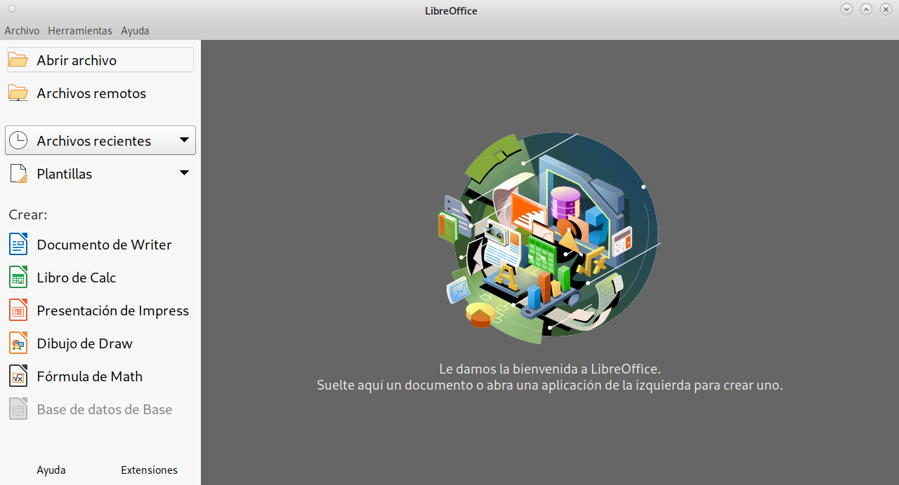
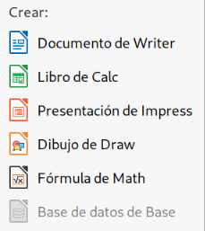
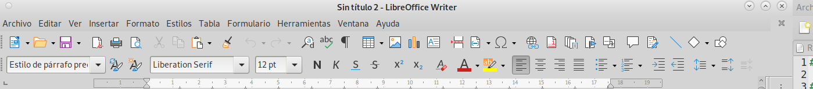
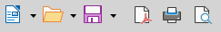
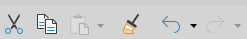
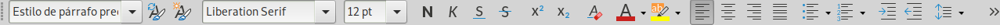
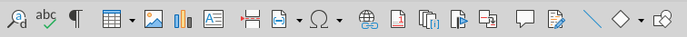

# Conoce la interfaz

## Iniciando LibreOffice

En esta práctica conocerá en primer lugar la interfaz de la ofimática completa 

En el cuadro gris obscuro, que le da la bienvenida, irán apareciendo los archivos abiertos recientemente. 

En la columna de la izquierda tenemos las opciones de 

__Abrir archivo__           Abre ventana para buscar algún archivo ya guardado.
__Archivos remotos__        Abre ventana para buscar algún archivo dentro de la red.
__Archivos recientes__      Abre ventana para buscar algún archivo abierto recientemente

posteriormente aparece la opción de crear diferentes tipos de archivos y seleccionamos procesador de textos, que es el primer icono de color azul.

Una vez creado el archivo, escribe algunas líneas, lo que gustes para empezar, por ejemplo "Hola mundo".

## Barra de menú

El menú de opciones está conformado por una línea de palabras que despliegan diferentes opciones al hacer click sobre ellas y una o más lineas de iconos con acciones específicas.

Desplace el ratón y valla leyendo las las opciones que se despliegan. Otra forma de acceder al menú es con la tecla Alt ubicada al lado izquierdo de la barra espaciadora, al oprimirla se subraya una letra que al oprimirla, es la que despliega el menu.
Practique con Alt y letra para abrir las opciones del menú.
 
## Iconos de archivo

En el menú de iconos, los primeros que encontramos son las opciones de archivo.

Algunos tienen al lado derecho un pequeño triángulo con el vértice hacia abajo, eso despliega opciones en el mismo icono.
En primer lugar tenemos el de NUEVO, es el icono azul que nos abre un nuevo archivo de texto, y si seleccionamos el triángulo derecho, nos da la opción de abrir diferentes tipos de archivos nuevos o en blanco. Intenta abrir algunos archivos diferentes.

El siguiente icono es una carpeta, nos sirve para abrir documentos ya guarados con anterioridad. Busca archivos que puedas abrir.

El icono de disquete nos guarda el archivo actual, si no ha sido guardado pide que escribas el nombre con que se guardará (Guardar como), prueba guardar, se puede guardar un mismo documento con varios nombres.

El siguiente nos guarda el archivo en formato PDF, para compartir el archivo con facilidad, guarde su archivo en pdf.

El icono de impresora manda el archivo actual a imprimirse y el último es una previsualización del archivo.

En general los iconos muestran alguna actividad de manera directa, sin necesidad de abrir el menú.

## Iconos de edición

Estos se activan al seleccionar alguna letra o palabra, y permanecerán activos porque se conserva en la memoria mientras esté abierto ese archivo

## Iconos de formato

Te permite acciones como seleccionar tipo de letra, tamaño, espaciado de las líneas, pero eso lo aprenderás poco a poco a través del curso

## Iconos varios

Te permiten funciones como insertar tablas, gráficas y otras funciones más

## Regla

La regla te sirve para modificar los márgenes, tabuladores, ancho de columnas

Las barras de iconos las puedes ir configurando a tu gusto, si hay alguna función que no utilizas la puedes quitar y colocar los iconos que te sean más utiles o más frecuentes, a tu gusto y necesidad.

Sigue probando los diferentes iconos, a lo largo de las prácticas, aprenderás a usar los demás.

