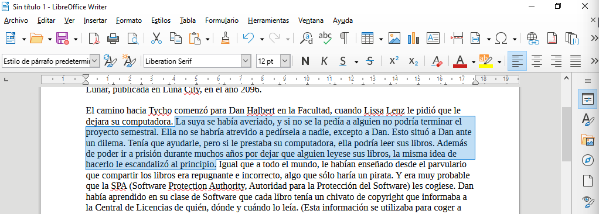
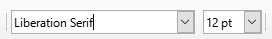
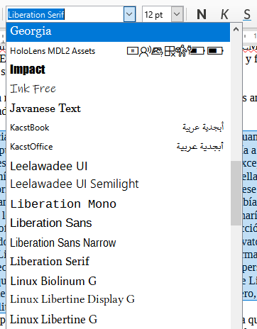
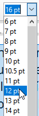
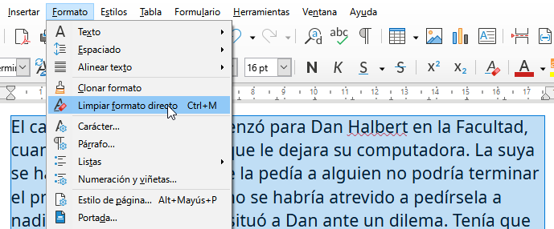

# Ejercicio sobre tipografía

En esta práctica aprenderá a:

- Seleccionar, cortar, copiar y pegar
- Formatear párrafos y caracteres

## Seleccionar

Coloque el ratón en el inicio del texto que quiera seleccionar y arrastre con el botón derecho del mismo hasta llegar al final del texto que quiera marcar.

## Cortar, copiar y pegar

Después de seleccionar, puede usar los botones en la barra de herramientas para cortar, copiar o pegar.

También puede usar los atajos de teclado `CTRL-X` para cortar, `CTRL-C` para copiar y `CTRL-V` para pegar. O bien el menú contextual que aparece con el botón derecho del ratón.

Además puede arrastrar el texto seleccionado con el ratón para moverlo a otro lugar.

## Formatear texto

Con el texto seleccionado, en la barra de herramientas de clic en el listado de los tipos de letra.

Elija el tipo de letra que prefiera.

Y para cambiar el tamaño elija la altura de la tipografia que se expresa en puntos.

## Eliminar el formato

Para regresar el texto a un formato inicial, use el boton o la opción en el menú **Formato > Limpiar formato directo**. Así retirará el cambio de tamaño, estilo o color del texto seleccionado.

## Ejercicio

Descargue [EL DERECHO A LEER](02-ejercicio-tipografia/el-derecho-a-leer.txt) y demuestre que puede mejorar la presentación de este ensayo.
