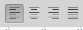
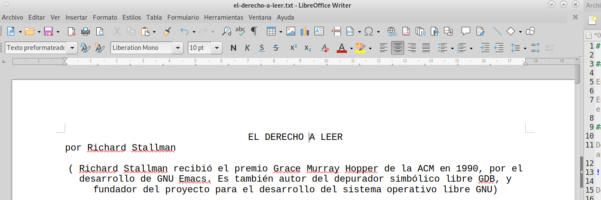
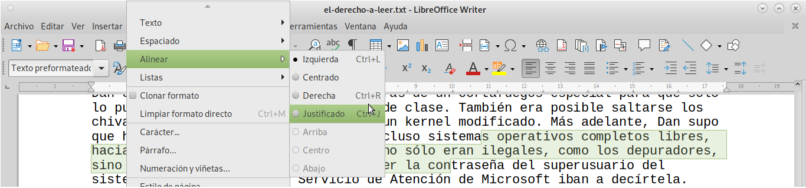
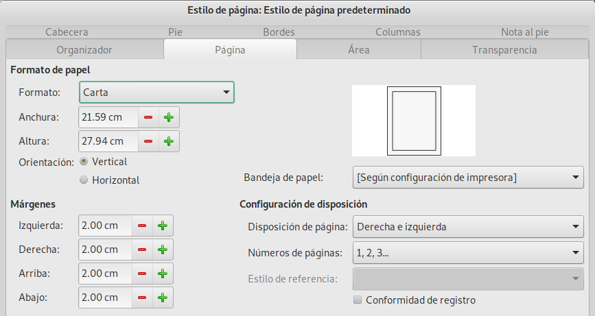
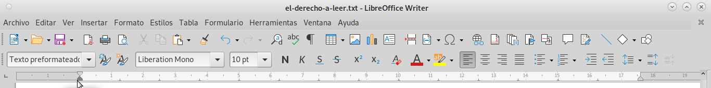

# Ejercicio sobre cómo alinear y cambiar márgenes

## Alineación y márgenes de texto

En esta práctica conocerás como ajustar la alineación del texto y márgenes.

En el ejercicio anterior, sobre tipografía, se te pidió descargar y cambiar la tipografía del archivo [EL DERECHO A LEER](02-ejercicio-tipografia/el-derecho-a-leer.txt) , utilizaremos este documento para ir modificando su presentación y practicar la alineación 

## Botones de alineación

Debajo de la barra de menú tenemos una serie de iconos, normalmente por defecto en la segunda barra de iconos, tenemos los iconos de formato, de la cual ya utilizaste en la práctica anterior, las opciones de tipografía.

De estos iconos utilizaremos los cuatro botones de alineación ubicados en esa segunda línea de iconos .

El primero es alineación izquierda  ,
el segundo alineación al centro o centrado de texto  ,
el tercero es alineación a la derecha  ,
y el último es justificado o márgenes rígidos, es decir las líneas de texto inician y terminan en el mismo margen  .

Vamos a hacer las modificaiones utilizando el archivo de [EL DERECHO A LEER](02-ejercicio-tipografia/el-derecho-a-leer.txt), abriéndolo en writer (editor de textos) de LibreOffce, primero colocamos el cursor en el renglón del título en cualquier carácter del título "EL DERECHO A LEER" y damos clic en el icono de centrado. Veamos el resultado, el título del documento se moverá al centro de la hoja.

repetimos el centrar en la siguiente línea "por Richard Stallman", y el siguiente pŕrafo lo alineamos a la derecha, colocando el cursor en cualquier parte del párrafo utlilizando el boton de alineación a la derecha . Observa el resultado. Si colocamos el cursor en un párrafo y modificamos su alineación, afectamos solo el párrafo, si seleccionamos dos o más párrafos, afectaremos únicamente a esa parte seleccionada, ¿pero cómo seleccionar más de un párrafo?, simplemente colocamos el cursor con el ratón en cualquier parte del párrafo inicial, oprimimos el boton principal del ratón y sin dejerlo de oprimir mueves el ratón para extender la selección a los suientes párrafos (no es necesario seleccionar todo el párrafo para aplicar la alineación deseada), una vez hecha la selección oprimimos el botón de alineación, prueba utlilizando los cuatro botones. 

## Alineación desde el menú

Otra manera de alinear nuestros textos es seleccionar la parte deseada e ir al menu y hacer los cambios mediante la opción de menú Formato-> Alinear 

Para  seleccionar todo el texto utilizamos la opción de menú-> Editar-> Seleccinar todo, con esto se seleccionará todo el texto, y podemos aplicar características de alineación de una sola vez, sin necesidad de hacerlo párrafo a párrafo, prueba hacerlo.

## Configurar márgenes
Los márgenes se pueden configurar para todo el texto, desde el menú-> Formato-> Estilo de página, se abre una ventana con diversas opciones de Estilo de Página, seleccionamos la pestaña de _Página_ y dentro de las opciones que se desplegan tenemos __Formato de papel__ se refiere al tamaño de la hoja que utilizaremos para imprimir, lo  más común es _Carta_ y los números que aparecen debajo, es el tamaño, que si los modificamos, podemos personaliar el tamaño de papel a utilizar.
La siguiente opción es __Márgenes__ aquí podemos cambiar los 4 márgenes de la hoja, si damos clic en _Aplicar_ podemos ver el cambio en el documento, sin salir de la opción de __Estilo de página__, prueba haciendo varios cambios, y dando aplicar para ir haciendo modificaciones sin salir, al terminar aplica con _Aceptar_.

También podemos ajustar los márgenes a uno o varios párrafos utilizando las reglas que nos provee __Write__ de __LibreOffice__ 

Fíjate en la imagen la posición del cursor, está sobre un pequeño _"triángulo"_ que se obscurece al pasar el cursor sobre el mismo, hay otro _"triángulo"_ al lado derecho de la regla, estos _"triángulos"_ nos permiten cambiar el márgen de uno o más párrafos, sin cambiar todo el documento.

Primero coloca el cursor y da clic en cualquier parte del párrafo a modificar, posteriormente selecciona el triángulo izquierdo, oprimiendo el botón del ratón y sin soltarlo, despazarlo a la derecha e izquierda, verás que aparece una línea punteada sobre el documento, donde sueltes el botón se desplazará el lado izquierdo del párrafo, haz lo mismo con el lado derecho del párrafo. Practica con otros párrafos y alínealos centrado, justificado derecha o izquierda, para que combines las opciones de esta práctica.

El _"triángulo"_ superior del lado derecho sirve para modificar la sangría al inicio del párrrafo, mueve a la derecha o izquierda para que veas el resultado, con esta segunda pŕatica, empiezas a personalizar tu documento, guárdalo, si gustas, ya que seguiremos editando este docuemento en las prácticas siguientes.

